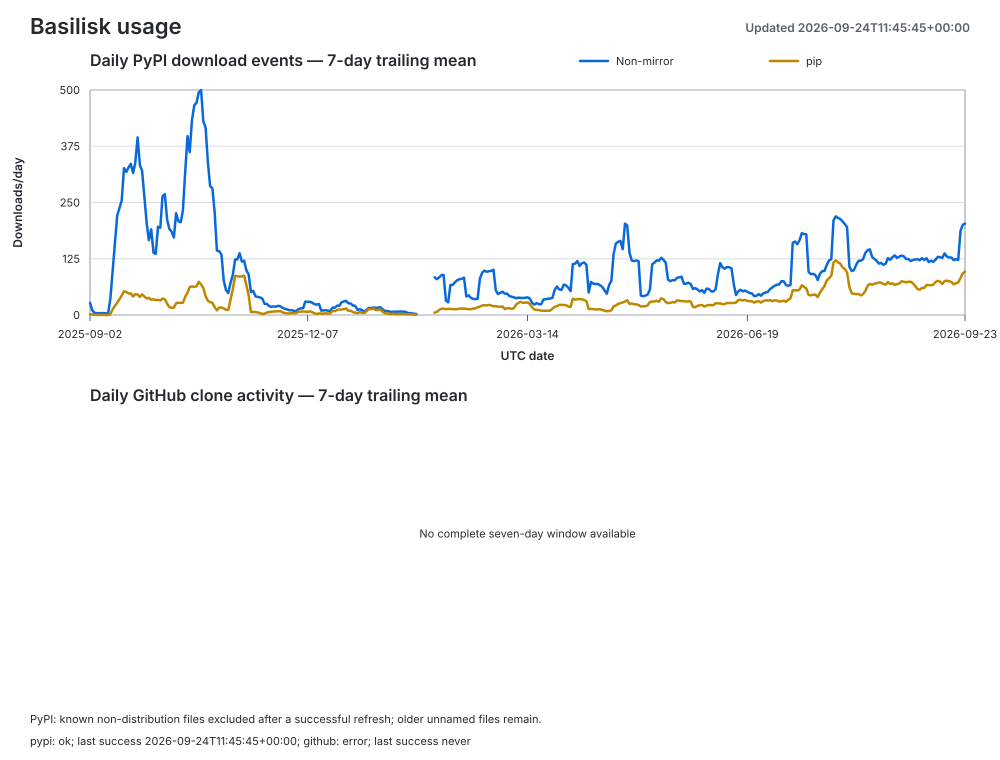

# Basilisk usage metrics

Updated 2026-09-24T11:45:45+00:00.
Collection status: **partial**.

| Source | Status | Last successful collection (UTC) | Latest error |
|---|---|---|---|
| pypi | ok | 2026-09-24T11:45:45+00:00 | none |
| github | error | never | A GitHub token with repository Administration read permission is required |

Failed sources retain their previous observations; they are not new daily snapshots.
Collection time does not guarantee that the upstream dataset is current; see coverage dates.

| Metric | Count | Coverage |
|---|---:|---|
| PyPI downloads excluding known mirrors | 38,886 | 2025-08-27 through 2026-09-23 |
| PyPI downloads made by `pip` | 12,201 | 2025-08-27 through 2026-09-23 |
| GitHub clone events retained by this tracker | unavailable | None through None |
| GitHub clones in the last successful API window | unavailable | None through None |
| Unique GitHub cloners in the last successful API window | unavailable | None through None |
| Last observed GitHub forks | unavailable | snapshot |
| GitHub release-asset downloads | unavailable | cumulative snapshot |

`metrics.csv` contains the daily history and `summary.json` contains the latest
machine-readable totals. `usage.svg` contains the plotted seven-day trends.

## Interpretation

- PyPI counts are file-download events, not verified installations or unique users.
  The `pip` count selects records whose installer is identified as `pip`.
- The non-mirror count excludes `bandersnatch`, `z3c.pypimirror`, `Artifactory`,
  and `devpi`, matching the known-mirror list documented by PyPI Stats.
- Counts exclude identified non-distribution files, including `.metadata` sidecars.
  Older records without filenames remain and may include metadata requests.
  PyPI changed its logging on 2026-08-24; historical counts are not fully comparable.
  Retained PyPI counting policy: `distribution_files_or_unknown_filename`.
  A successful PyPI refresh applies the revised filter to returned historical dates.
- Plots require seven consecutive observed days. Explicit zeros count; absent dates
  remain unknown and break the plotted series. The latest reported day may be partial.
- GitHub exposes clone traffic for only the latest 14 days. The tracker preserves
  those daily counts; gaps longer than 14 days cannot be recovered.
- Daily unique-cloner values cannot be summed into an all-time unique-user count.
- Forks are currently existing forks, not a lifetime count of every fork ever made.
- Release downloads cover uploaded release assets only. GitHub provides no download
  count for its automatically generated source ZIP and tar archives.

The data comes from the public PyPI dataset through
[ClickPy](https://clickpy.clickhouse.com/) and from the
[GitHub REST API](https://docs.github.com/en/rest/metrics/traffic).
